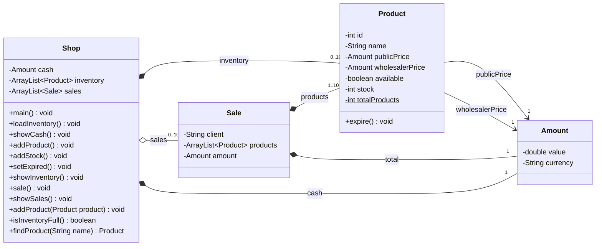

## About Shop application
> Using this small program to explain about the OOP.

> To run the program, please read the follow:
#### Requirements
* Java 1.17

#### Features
1. Show cash
2. Add product
3. Add stock
4. Set product as expired
5. Show inventory
6. Sale products
7. Show sales

#### Installation
```
git clone https://github.com/Stucom-Pelai/MP0485_RA4_POO_Shop
```

#### Run 
```
run file main.Shop.java
```

#### Class Diagram


